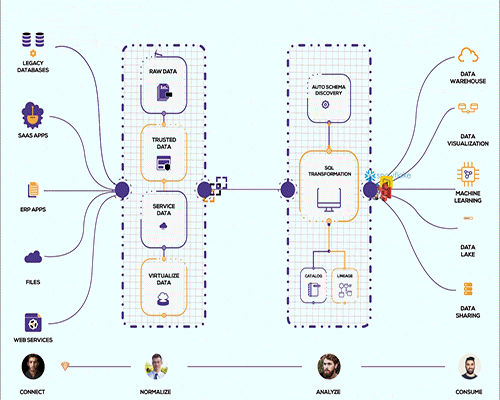

# Data Pipelines

Organizations are striving to become data-driven, moving away from intuitive decision-making to fact-based decisions supported by data. However, many enterprises face challenges in implementing this approach because the workforce handling these tasks is often non-technical. Making data accessible for analytics involves complex technical processes. Data pipelines address this issue by simplifying data analysis for business analysts, enabling more efficient decision-making.

### Pipelines in Lyftrondata

A data pipeline in Lyftrondata is a no-code data processing framework that loads data from various sources, such as databases, SaaS applications, or files, into a destination database or data warehouse. For instance, you can load data from your Facebook Ads account into a Google BigQuery data warehouse for analysis.

With just a few clicks, you can have analysis-ready data at your fingertips, without any data loss. You can even view samples of incoming data in real-time as it loads from your source into your destination.

<figure><figcaption>
Data Pipeline Flow
</figcaption></figure>

