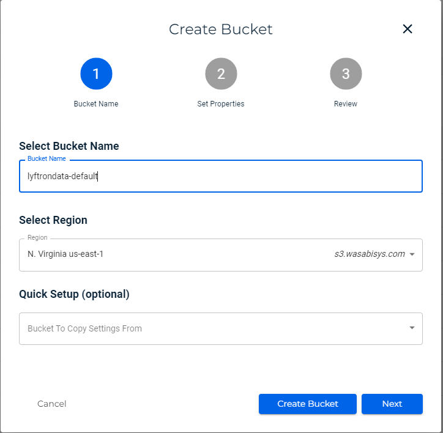
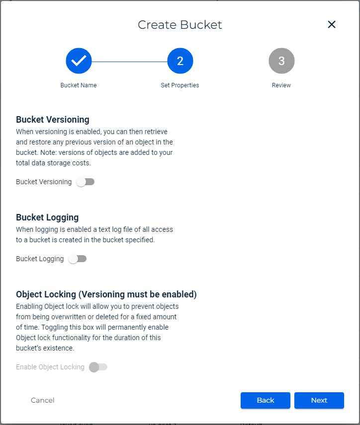
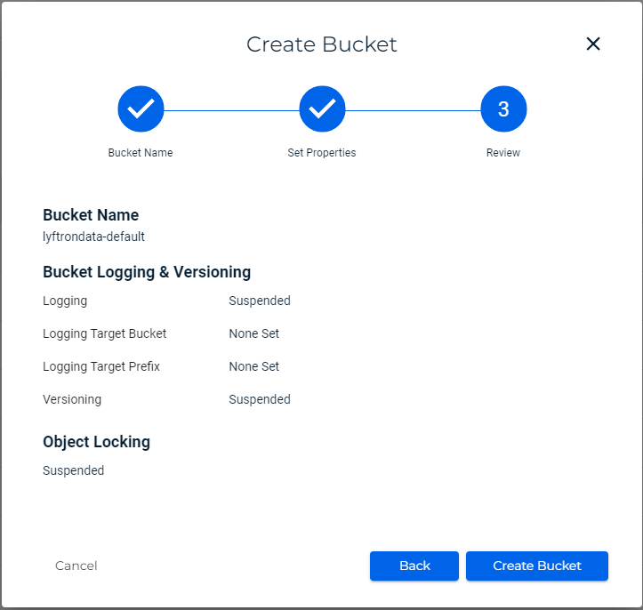

# Wasabi

**Step 1: Access Wasabi Management Console**

1. Navigate to the wasabi Management Console by visiting [https://console.wasabisys.com/](https://console.wasabisys.com/) and sign in with your Wasabi account credentials.

**Step 2: Create Wasabi Buckets**

The application requires three Wasabi buckets: `<your-company-default-bucket-name>`, `<your-company-connectors-bucket-name>`, and a `<your-public-company-logos-bucket-name>` bucket with a public ACL policy attached. Follow these steps to create the buckets:

1. Click on the "Services" menu in the top-left corner of the console and select "S3" under the "Storage" section.
2. Click on the "Create bucket" button.
3.  Enter a name for your buckets according to above suggested `<your-company-default-bucket-name>` and choose the region where you want to create the bucket. Click "Create bucket" to proceed.\
    \


    <figure><figcaption></figcaption></figure>

    <figure><figcaption></figcaption></figure>

    <figure><figcaption></figcaption></figure>
4. Repeat steps 2-3 to create the `<your-company-connectors-bucket-name>` and public `<your-public-company-logos-bucket-name>` buckets, ensuring the desired region for each bucket.
5. For the public `<your-public-company-logos-bucket-name>`, select the bucket after creation and click on setting and navigate to the "Permissions" tab.
6. Under "Bucket policy," click on "Edit" and paste the following JSON policy:

```json
{
  "Version": "2012-10-17",
  "Statement": [
    {
      "Sid": "AllowPublicRead",
      "Effect": "Allow",
      "Principal": {
        "AWS": "*"
      },
      "Action": [
        "s3:GetObject",
        "s3:GetObjectVersion"
      ],
      "Resource": "arn:aws:s3:::your-public-company-logos-bucket-name/*",
      "Condition": {
        "StringLike": {
          "aws:Referer": [
            "YOUR-OFFICE-PUBLIC-IP/32" 
          ]
        }
      }
    }
  ]
}
```

Replace `<your-public-company-logos-bucket-name>` with the name of your public logos bucket.

7. For the connectors bucket, repeat the 5 and 6 steps and use the below JSON policy:

```json
{
  "Version": "2012-10-17",
  "Statement": [
    {
      "Sid": "AllowPublicRead",
      "Effect": "Allow",
      "Principal": {
        "AWS": "*"
      },
      "Action": [
        "s3:GetObject",
        "s3:GetObjectVersion"
      ],
      "Resource": "arn:aws:s3:::<your-company-connectors-bucket-name>/*",
      "Condition": {
        "StringLike": {
          "aws:Referer": [
            "YOUR-OFFICE-PUBLIC-IP/32"
          ]
        }
      }
    }
  ]
}
```

7. Click on "Save changes" to apply the policy.

**Step 3: Verify Setup**

You can verify the setup by navigating back to the "Buckets" dashboard in the S3 service of the AWS Management Console. Ensure that all three buckets (`<your-company-default-bucket-name>`, `<your-company-connectors-bucket-name>`, `<your-public-company-logos-bucket-name>`) are listed.

**Step 4: Create Wasabi User:**

* Go to "Users" and click on create user button.
* Enter a username for the new wasabi user and select "Programmatic (create API key)". You can also choose "Console access" if you want the user to have access to the Wasabi Console.
* Click "Next: Groups" if you want to add that user in to any group". You can skip this by clicking next button.
* Click" Next: Policies" to proceed.
* Attach the custom policy which you have created earlier and click next to review the user then create user.
* Pop up will occur to copy Access Key and Secret Key or download the csv file which contains the Access Key and Secret Key.

**Step 5**: **After user and bucket creation**

* Follow the lyftrondata installation [document](../lyftrondata-installation/) for installation.

