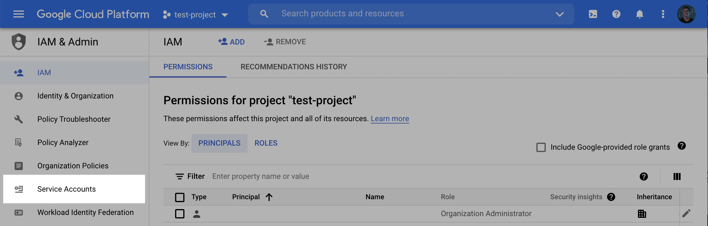

# Prerequisite

### Setup Instructions

Follow the below pre-requisite steps for [Bigquery](https://www.lyftrondata.com/integration/data-warehouse/google-bigquery/) driver setup with [Lyftrondata](https://www.lyftrondata.com). These two permissions are required for BigQuery to interact with Lyftrondata.

1. **Cloud Storage Permissions**
2. **IAM Permissions**\

### Video Instruction



### Manual Instruction

### Step 1: Create a service account in the BigQuery project

1. In the GCP console, navigate to the **IAM & Admin** menu.

<figure><figcaption></figcaption></figure>

2. Click on the **Service Accounts** tab.

<figure><figcaption></figcaption></figure>

3. Click **Create service account** at the top of the menu.

<figure><figcaption></figcaption></figure>

4. In the first step, name the user and click **Create and Continue**.

<figure><figcaption></figcaption></figure>

5. In the second step, grant the user the role **BigQuery User**.

<figure><figcaption></figcaption></figure>

> Loading data into a dataset that already exists
>
> By default, we will attempt to create a new dataset (with a name you provide) in the BigQuery project. If instead you create the dataset ahead of time, you will need to grant the BigQuery Data Owner role to this Service Account at the dataset level.
>
> * In BigQuery, click on the existing dataset. In the dataset tab, click **Sharing**, then **Permissions**. Click **Add Principals**. Enter the Service Account name, and add the Role: **BigQuery Data Owner**

6. In the third and final step, click **Done**.
7. Back in the **Service accounts** menu, click the Actions dropdown next to the newly created service account and click **Manage keys**.

<figure><figcaption></figcaption></figure>

8. Click **Add key** and then **Create new key**.

<figure><figcaption></figcaption></figure>

9. Select the **JSON** Key type and click **Create** and make note of the key that is generated.

\

<figure><figcaption></figcaption></figure>

### Step 2: Create a staging bucket

1. Log into the Google Cloud Console and navigate to **Cloud Storage**. Click **Create** to create a new bucket.

<figure><figcaption></figcaption></figure>

1. Choose a **name** for the bucket. Click **Continue**. Select a **location** for the staging bucket. Make a note of both the **name** and the **location** (region).

> Choosing a `location` (region)
>
> The location you choose for your staging bucket must match the location of your destination dataset in BigQuery. When creating your bucket, be sure to choose a region in which BigQuery is supported [(see BigQuery regions)](https://cloud.google.com/bigquery/docs/locations)
>
> * If the dataset **does not** exist yet, the dataset will be created for you in the same region where you created your bucket.
> * If the dataset **does** exist, the dataset region must match the location you choose for your bucket.

2. Click **continue** and select the following options according to your preferences. Once the options have been filled out, click **Create**.
3. On the **Bucket details** page that appears, click the **Permissions** tab, and then click **Add**.

<figure><figcaption></figcaption></figure>

4. In the **New principles** dropdown, add the Service Account created in **Step 1**, select the **Storage Admin** role, and click **Save**.

<figure><figcaption></figcaption></figure>

1. Log into the Google Cloud Console and select the projects list dropdown.
2. Make note of the BigQuery **Project ID**.

### Step 3: Find Project ID

\

<figure><figcaption></figcaption></figure>

### Step 4: Gather the required setup information

For the data export setup, you will need:

* Bucket Name
* Dataset Name
* Service Account JSON

### Quickstart Steps

Do you have questions about how to use the platform? Don't worry; we've got you covered. Simply follow the quickstart instructions [here](./).

### Questions? 

We're always happy to help with any other questions you might have! [Set up a meeting with our experts](https://www.lyftrondata.com/book-a-meeting/).
